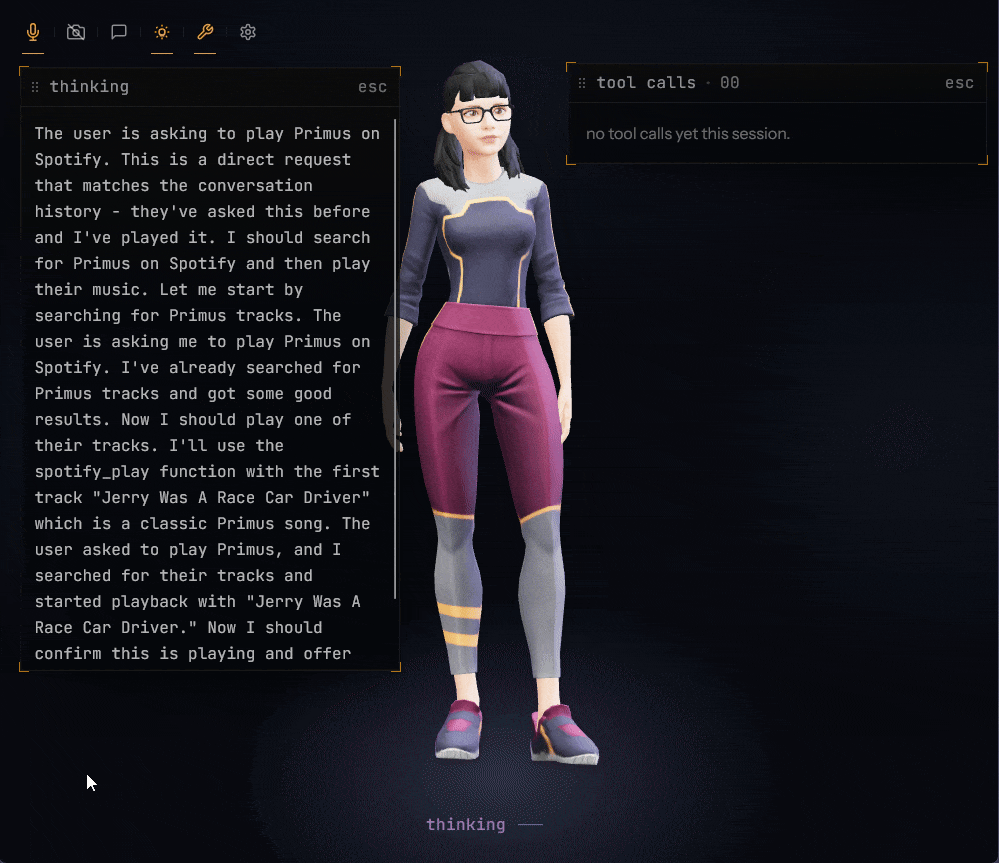
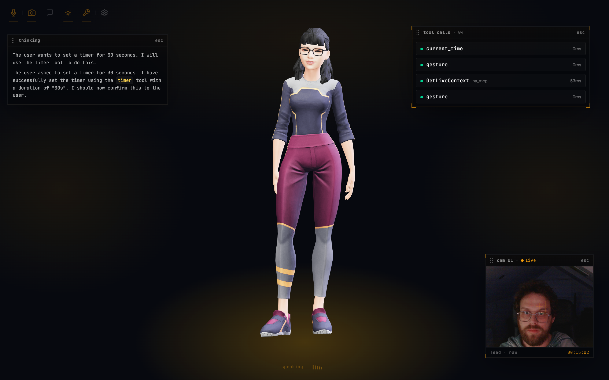
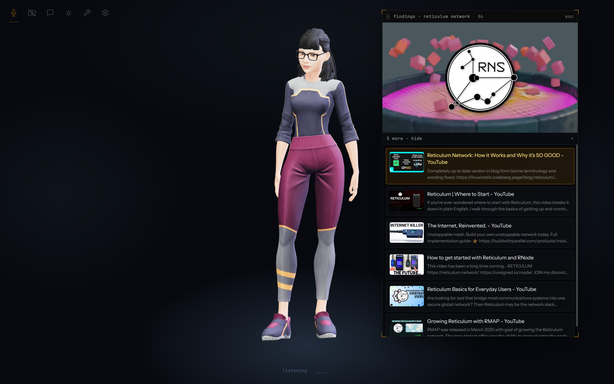
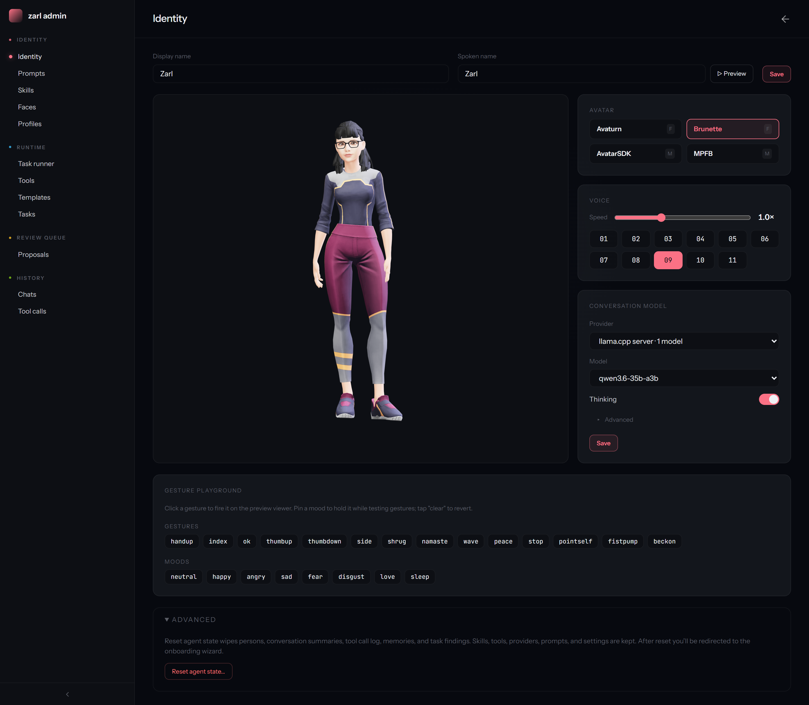
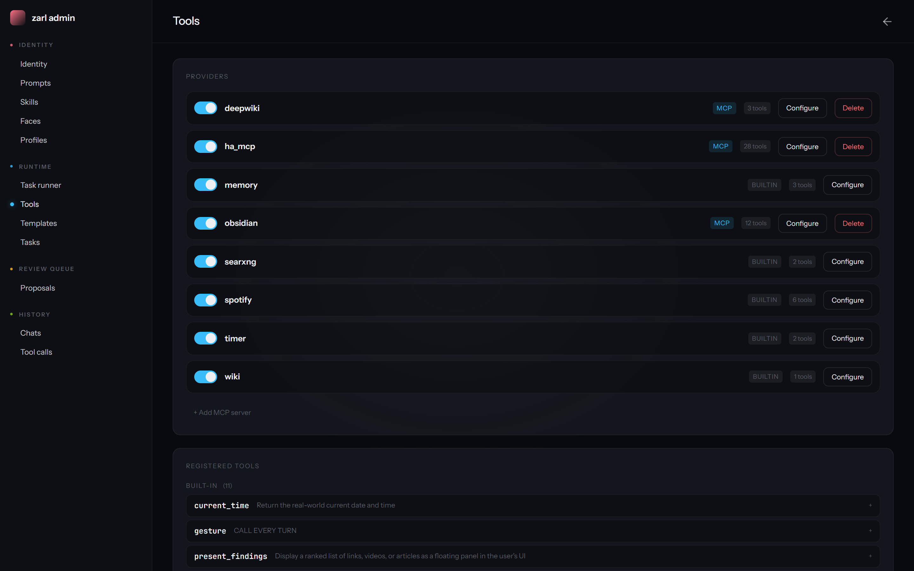

# Zarl

[](https://github.com/zarldev/zarlmono/actions/workflows/ci.yml)
[](LICENSE)

A local, multimodal conversational AI assistant. Single Go binary with an
embedded React frontend, talking to local inference servers for speech,
vision, and LLM.

Built on [`zkit`](../zkit/) — the shared substrate for agent runtime, LLM providers, tools, MCP, and vector storage.



## Screens

The interactive surface is at `/` (Immersive — camera + talking head),
`/onboard` (first-run wizard), and `/admin` (configuration panel).

| | |
|---|---|
|  |  |
| **Immersive** — camera, talking head, ambient sensors | **In conversation** — voice command surfaces multimedia results |
|  |  |
| **Onboard** — first-run setup (name, voice, model, face) | **Admin → Identity** — agent name, voice, avatar, gestures, model |
|  | |
| **Admin → Tools** — tool providers + dynamic selection | |

## What it does

- **Speech-to-text** via sherpa-onnx (Whisper / Moonshine models)
- **LLM inference** via `llama.cpp` server (OpenAI-compatible endpoint)
- **Text-to-speech** via sherpa-onnx (Kokoro voices)
- **Face recognition** via dlib / go-face (128-dim embeddings, per-person
  memory across sessions)
- **Tool calling** — Home Assistant control, Obsidian vault read/write,
  Spotify playback, web search (SearXNG), local Wikipedia semantic
  search, per-person memory (Qdrant), timers, generic MCP servers
- **Autonomous background tasks** with named profiles:
  - **researcher** — multi-step web/wiki research with Obsidian
    write-up
  - **coder** — bash + file editing in a workspace, autonomous code
    changes
  - **default** — general-purpose loops, scheduled or ad-hoc, with
    findings persisted back to Qdrant
- **Ambient sensors** — periodic observers (Home Assistant state,
  time-of-day, Spotify now-playing, MCP pushes) that feed the assistant
  without the user asking
- **[Skills](docs/skills.md)** — markdown capability guides (e.g.
  "weekly review", "research note organization") that get
  semantically routed into the prompt only on turns where they apply
- **Self-improvement loop** — the LLM can propose new tools, sensors,
  prompt changes, and skills via dedicated proposal queues in `/admin`

## Built on zkit

`zarlai` is a consumer of [`zkit`](../zkit/), the shared Go toolkit in this monorepo:

| zarlai feature | zkit package |
|----------------|--------------|
| LLM inference | `zkit/ai/llm` (provider abstraction + OpenAI-compatible backends) |
| Tool system | `zkit/ai/tools` (registry, typed handlers, MCP bridge) |
| Background tasks | `zkit/agent/runner` + `zkit/agent/scheduler` |
| Sensors | `zkit/agent/sensor` |
| Web search | `zkit/ai/tools/search` |
| Vector storage | `zkit/vectorstore/qdrant` |
| Notifications | `zkit/znotify` |

Domain-specific logic (Home Assistant, face/voice, React frontend) is local to `zarlai`.

## Quickstart

Run these from the `zarlai/` module directory. From the repository root, either
`cd zarlai` first or use the equivalent `go tool task zarlai:*` tasks.

```bash
cd zarlai

# 1. Install model files under deploy/models/ — see docs/running.md.
#    Always: whisper-small-en/, kokoro-en-v0_19/, dlib/.
#    Plus a GGUF only if you'll run the bundled llama-server (step 5);
#    skip if you're pointing at a hosted endpoint or Ollama instead.
# 2. Configuration
cp .env.example .env
$EDITOR .env                 # set CHAT_URL, CHAT_MODEL at minimum
# 3. Bootstrap (npm install + buf generate)
task setup
# 4. Backing services (Dolt :3307, Qdrant :6333, SearXNG :8888)
task up
# 5. Optional: spawn the llama-server container if you have an NVIDIA GPU
task up:llm
# 6. Build + run
task build
task run                     # ./zarl, with .env loaded by Taskfile
```

For frontend hot-reload during development, run the binary in one
terminal and `task frontend:dev` in another (Vite on `:5173`, proxies
RPC to `:8080`).

### Run with Docker

The `Dockerfile` produces a slim Debian image (~150 MB) with the Go
binary, dlib, cblas, and libjpeg already wired up.

```bash
docker build -t zarl:local .
task up                       # backing services
docker run --rm --network host \
    --env-file .env \
    -v "$MODELS_DIR:/models:ro" \
    zarl:local
```

CI builds and tests this image on every PR.

### First run

```bash
task doctor                   # preflight: toolchain, .env, models, services
```

Open `http://localhost:8080`. On a fresh database go to
`http://localhost:8080/onboard` first to enrol your face, voice, and
agent settings via the wizard. After that, `/` is the conversational
view, `/admin` is the admin panel.

Smoke test:
```bash
curl -fsS http://localhost:8080/                   # 200 = SPA served
curl -fsS http://localhost:8081/v1/models          # llama-server (only with task up:llm)
curl -fsS http://localhost:6333/healthz            # qdrant
```

## Hardware alternatives

The default config targets a **single 24 GB NVIDIA GPU running
Qwen3.6-35B locally**. You don't need that — zarl talks to any
OpenAI-compatible endpoint.

- **Mac / Linux without an NVIDIA GPU:** Ollama replaces the
  llama-server container.
- **Smaller NVIDIA GPU (8–16 GB):** swap in a smaller GGUF and adjust
  `deploy/docker-compose.yml`.
- **Hosted endpoint (zero local compute):** point at OpenRouter,
  Groq, Together, etc.

Recipes for each tier in
[`docs/running.md`](docs/running.md#hardware-alternatives).

## Architecture

Single binary. Protobuf is the source of truth for the API
(ConnectRPC, gRPC-Web compatible). Go backend serves both the RPC API
and the embedded React SPA.

```
cmd/zarl/          entry point, wires everything
service/           business logic (LLM, STT, TTS, face, session, tools)
repository/        data access (sqlc against Dolt / MySQL)
qdrant/            vector store client (memory, wiki, task findings)
transport/grpc/    ConnectRPC handlers
proto/zarl/v1/     API contract (.proto files)
migrations/        DB schema (consumed by sqlc + mounted into Dolt)
frontend/          React 19 + Vite + Tailwind v4
taskrunner/        autonomous background task loops (zkit/agent/runner)
sensor/            periodic ambient observers (zkit/agent/sensor)
subscribers/       event-bus subscribers (session lifecycle, memory, etc.)
events/            in-process bus that sensors and subscribers ride
tools/             tool implementations (homeassistant/, memory/, spotify/, ...)
deploy/            docker-compose.yml + searxng config + models/ (gitignored)
```

For request flow, the tool system, taskrunner internals, and where
state lives, see
[`docs/architecture.md`](docs/architecture.md).

## Configuration

Essentials (full table in
[`docs/running.md`](docs/running.md#environment-variables-full)):

| Variable | Default | Purpose |
|---|---|---|
| `CHAT_URL` | — | OpenAI-compatible chat endpoint |
| `CHAT_MODEL` | — | Model name on that endpoint |
| `MODELS_DIR` | `./deploy/models` | STT/TTS/dlib/GGUF root (fixed subpaths) |
| `DOLT_DSN` | `root:@tcp(localhost:3307)/zarl?parseTime=true` | Database DSN |
| `EMBED_URL` | `http://localhost:11434/v1` | OpenAI-compatible /v1 embeddings endpoint |

`.env.example` is the canonical reference; copy it.

## Contributing

See [`CONTRIBUTING.md`](CONTRIBUTING.md) for branch/style/commit
conventions.

## License

MIT — see the repository [LICENSE](../LICENSE).