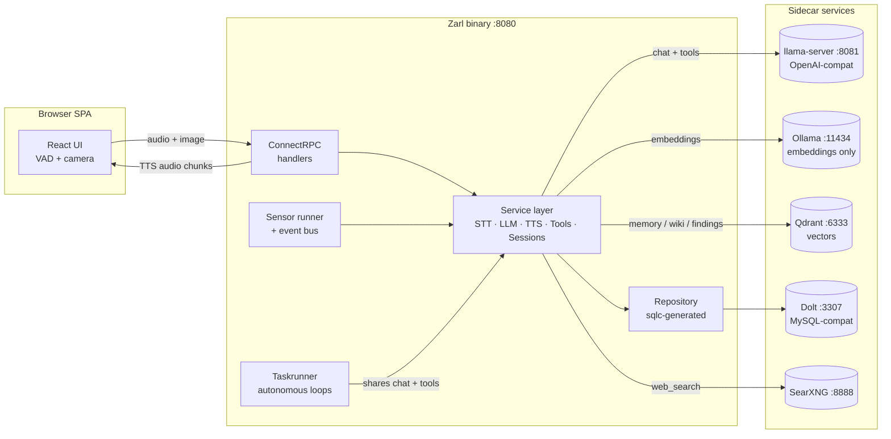

# Architecture

Zarl is a single Go binary that serves a ConnectRPC API plus an
embedded React SPA on `:8080`. It depends on four sidecar services
(Dolt, Qdrant, SearXNG, llama-server) that are operator-supplied via
`docker compose`. This page describes how a request moves through the
binary, where state lives, and the extension points worth knowing.

## At a glance



## The request that matters: `ZarlService.Converse`

Server-streaming RPC (entry point `transport/grpc/server.go`
`ZarlServer.Converse`). One call carries the full audio/text turn and
streams back transcription, LLM text deltas, and TTS audio chunks.

```
client request                    server work                    streamed back
──────────────                    ───────────                    ─────────────
audio (WAV) + optional image  →   STT (sherpa-onnx)          →   transcription
                                  ↓
                                  ToolSelector embeds the user
                                  message vs. each tool's
                                  description (cached, top-N)
                                  ↓
                                  LLM call (llama-server,
                                  OpenAI-compatible chat)     →   text deltas
                                  ↓
                                  Tool calls executed via
                                  service.Registry, results
                                  fed back to LLM             →   more text
                                  ↓
                                  Final text → Kokoro TTS     →   audio chunks
```

The transcript is logged through `Session` and any persistent state
(memories, task findings, voice settings, prompts) goes through the
repository layer to Dolt or Qdrant.

## Layer separation

Each layer owns its types — there's no shared "domain" package.

| Layer            | Where                          | Owns                                                    |
|------------------|--------------------------------|---------------------------------------------------------|
| Transport        | `transport/grpc/`              | ConnectRPC handlers, request/response wire types        |
| Service          | `service/`                     | Business logic, tool registry, session, sensors         |
| Repository       | `repository/` (+ `gen/`)       | sqlc-generated queries against Dolt                     |
| Vector store     | `qdrant/`                      | Memory, wiki search, task findings                      |
| Proto            | `proto/zarl/v1/`               | API contract (source of truth for both sides)           |

Mapping happens at boundaries. The frontend's TS clients live in
`frontend/src/gen/`, generated from the same protos.

## The tool system

Anything the assistant can *do* outside of generating text is a tool.
The contract:

```go
// service/tool.go
type Tool interface {
    Definition() ToolDefinition // name, description, JSON schema
    Execute(ctx, args) ToolResult
}
```

Tools register at startup into a `service.Registry`. Per turn,
`service.ToolSelector` picks the top-N most relevant tools by cosine
similarity between the user message embedding and each tool's
description embedding (cached, invalidated on `Registry.Version()`
change). Five always-on core tools (`current_time`, `gesture`,
`render_chart`, `remember`, `recall`) are appended unconditionally.

Tools are organised by package:

- `tools/` — task management (`start_task`, `task_status`, `schedule_task`), time
- `tools/homeassistant/` — `ha_get_state`, `ha_call_service`, `ha_list_entities`
- `tools/memory/` — `remember`, `recall`, `forget` (per person, in Qdrant)
- `tools/searxng/` — `web_search`
- `tools/wiki/` — semantic search over local Wikipedia in Qdrant
- `tools/timer/`, `tools/mcp/`, `tools/code/` — timers, generic MCP wrapper, the coder lane
- `tools/spotify/` — playback control via the Spotify Web API

Provider config (URLs, tokens, MCP server addresses) lives in the
`tool_providers` Dolt table and is administered through `AdminService`
and `transport/grpc/tool_manager.go`.

## Background tasks: the taskrunner

`taskrunner/runner.go` runs autonomous LLM loops independent of the
real-time conversation:

- Each task iterates up to its profile's `MaxIterations`, calling tools
  and accumulating findings.
- Uses a separate `*openai.Client` and `*http.Client` so its requests
  don't serialise with the conversation path. Concurrency at the
  llama-server is provided by `-np 2` (two parallel slots).
- A `ConversationLock` lets the real-time path pre-empt long-running
  iterations.
- `start_task` and `schedule_task` are excluded from the runner's tool
  set to prevent recursive spawning.
- Findings are embedded and written to Qdrant (`task_findings`
  collection); per-iteration progress notifications go through
  `NotificationStore` to the frontend.
- `taskrunner/scheduler.go` handles cron-based recurring tasks via
  `robfig/cron/v3`.

### Task profiles

Profiles (`taskrunner/profile.go`, `builtin_profiles.go`) are named
execution skeletons — a tool whitelist, an optional model override, a
prompt prefix, a `MaxIterations`. Built-ins: `default`, `researcher`,
`coder`. DB-backed `TaskProfileOverride` rows merge in at runtime to
produce a `ResolvedProfile`. This is how the runner gets a different
"personality" without forking.

## Sensor system

`sensor/Runner` runs periodic observers that push notifications onto
the session bus when their value *changes*, so the assistant has
ambient awareness without being asked.

```go
type Sensor interface {
    Key() string
    Interval() time.Duration
    Poll(ctx) (Observation, error) // ErrNoChange when unchanged
}
```

Concrete sensors: `hass_state` (Home Assistant entities),
`mcp_notification` (server pushes), `timeofday`, `fromtool` (wraps any
tool call as a sensor), `reactive`. Intervals under 100ms are clamped
to keep a misconfigured sensor from burning CPU.

Sensor *proposals* — the LLM asking for a new sensor to be installed
— flow through `repository/sensor_proposal.go` and
`taskrunner/propose_sensor.go`.

## Skills

Skills are markdown capability guides — short documents that describe
*how* to do something well (e.g. "how to research a topic", "how to
write a daily note") — that get injected into the LLM's system prompt
on the turns where they're relevant. Stored in Dolt (`skills` table,
migration `016_skills.sql`), selected per turn by semantic ranking.

```go
type Skill struct {
    ID, Name, Description, Markdown string
    ProfileBinding string // empty = global, else "default" / "researcher" / "coder"
}
```

`service.SkillSelector` mirrors `ToolSelector`: each skill's
description is embedded once, the user message is embedded per turn,
top-K cosine matches plus an always-on set are unioned, and the
markdown bodies are concatenated into the system prompt. Profile
binding lets a skill apply only when the active task profile matches
— a "coder" skill stays out of the conversation path, a global skill
ships everywhere. The selector rebuilds its index when
`SkillSource.Version()` ticks (admin edit, proposal approval).

This is deliberately prompt-stack composition rather than learned policy. Semantic selection keeps the stack smaller and more relevant, but it does not prove a skill improves behaviour; operators should keep skill bodies concise and inspect which fragments were active when debugging a turn.

Skill *proposals* mirror prompt and sensor proposals: the LLM writes
to `skill_proposals`, an operator approves via `/admin → Proposals`,
approval flips the live skill row. Source: `repository/skill.go` +
`skill_proposal.go`, `service/skill.go` + `skill_selector.go`,
migration `016_skills.sql`, RPCs `ListSkills` /
`ReviewSkillProposal` etc. on `AdminService`.

For operator-facing guidance on writing skills (description shape,
profile binding, what *not* to put in a body), see
[`docs/skills.md`](skills.md).

## Where state lives

| Store    | What                                                                                  |
|----------|---------------------------------------------------------------------------------------|
| Dolt     | `prompts`, `persons` (face embeddings as JSON), `tool_providers`, `tool_calls`, `tasks`, `settings`, `task_profile_overrides`, `sensor_proposals` |
| Qdrant   | `memory` (per-person), `wiki`, `task_findings`                                        |
| In-proc  | Session bus, sensor runner, tool registry, embedding cache                            |
| Disk     | All pretrained assets (STT, TTS, dlib, GGUF) under `MODELS_DIR` (default `./deploy/models`) with fixed subpaths |

## Code generation

The two generators run via `task proto` and `sqlc generate`:

- **Protobuf** (`buf generate`) — Go server stubs into
  `transport/grpc/gen/`, TS clients into `frontend/src/gen/`. Source of
  truth is `proto/zarl/v1/`.
- **SQLC** — queries in `repository/queries/*.sql`, output in
  `repository/gen/`, config in `repository/sqlc.yaml`. Re-run after
  changing `queries/` or `migrations/`.

## Extending it

| You want to…                          | Touch                                                  |
|---------------------------------------|--------------------------------------------------------|
| Add a tool                            | new pkg under `tools/` or `<name>/`, implement `service.Tool`, register in `cmd/zarl/main.go` |
| Add a sensor                          | implement `sensor.Sensor`, wire it through `cmd/zarl/sensors.go` |
| Change the API surface                | edit `proto/zarl/v1/*.proto`, `task proto`, implement on both sides |
| Add a DB table or query               | new migration in `migrations/`, query in `repository/queries/`, `cd repository && sqlc generate` |
| Give the taskrunner a new personality | new profile in `taskrunner/builtin_profiles.go` (or DB override) |
